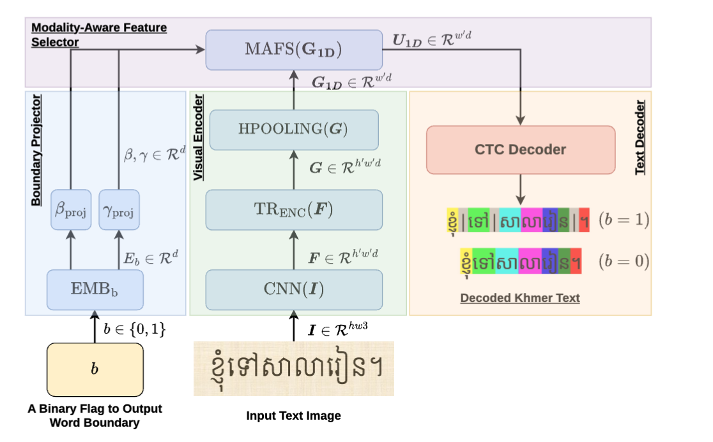

# KTRWS

Joint Khmer text recognition and word segmentation — [arXiv:2608.30213](https://arxiv.org/abs/2608.30213).

One CTC model reads Khmer text and, with `b = 1`, marks word boundaries with `U+200B`.



## Run

```sh
curl -LO https://github.com/seanghay/KTRWS/releases/download/v0.1.0/ktrws.pt
uv run python -m ktrws.infer line.png --sep "|"
```

4.05% CER and 77.5% segmentation F1 on 2,000 held-out lines.

## Train

```
data/vocab.txt                       one KCC token per line
data/{train,dev,test}/images/*.png
data/{train,dev,test}/labels.jsonl   {"image": …, "text": …, "segmented": …}
```

```sh
uv run python -m ktrws.train --data data --epochs 5 --device cuda --workers 8
```

Each image trains twice: plain text as the `b = 0` target, segmented as `b = 1`.
On Apple Silicon, `--device mps` needs `PYTORCH_ENABLE_MPS_FALLBACK=1`.
